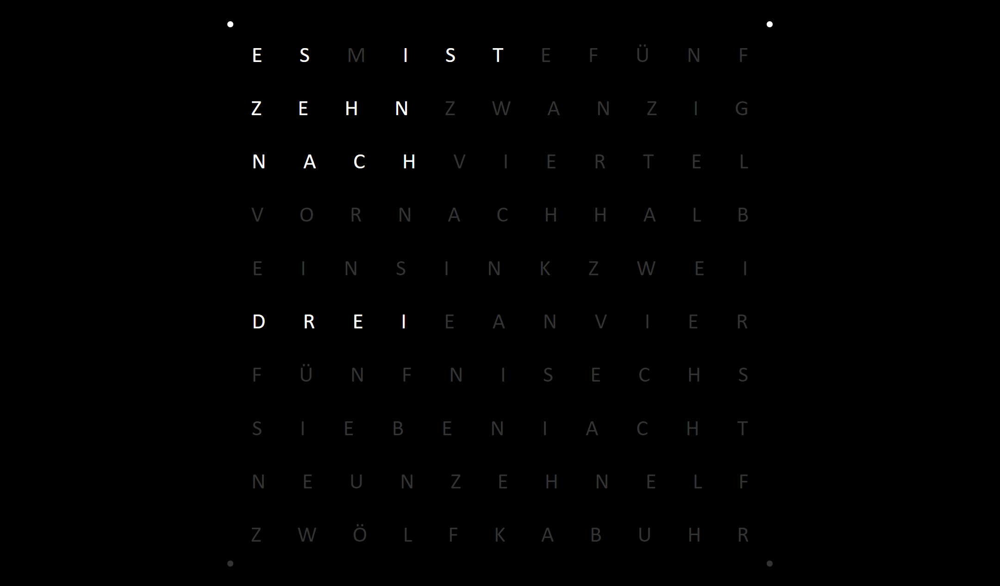

# Wordclock
Dies ist eine Browserwordclock, welche unter Chrome getestet und entwickelt wurde.

@Copyright: Raphael Höser (Snapstromegon)

## Anmerkungen des Entwicklers

### Dieses GIT
Dieses GIT ist stets auf dem aktuellen Stand, wird jedoch nicht als Stable gehandelt, daher kann es zu Fehlern aufgrund nicht unterstützter APIs kommen. Ich werde versuchen in nächster Zeit einen Installationsguide hier zu veröffentlichen, kann allerdings keinen Zeitrahmen vorgeben.

Falls Fehler gefunden werden, oder Verbesserungsvorschläge bestehen, bin ich (fast) immer erreichbar.

### Sprachpakete
Aktuell unterstützt das System Deutsch und Englisch, kann allerdings durch Sprachpakete erweitert werden.
Ich freue mich über jedes Sprachpaket, welches ich in dieses GIT übernehmen oder verlinken darf!


#### Übersicht über verfügbare Sprachpakete
| Sprache  | Kürzel | wc_langPack       |
| :------- |:------:|:----------------- |
| Deutsch  | DE     | wc_langPack_DE.js |
| Englisch | EN     | wc_langPack_EN.js |

## Screenshot




## Installation

### Dateien

Es werden für diese Wordclock folgende Dateien benötigt:
- **./wc.html**  
  Das HTML-Gerüst der Uhr
- **./wc_main.js**  
  Die Logik der Uhr
- **./wc_base.css**  
  Layout und Farbschema
- **./wc_langPacks/wc_langPack_DE.js**  
  Das Sprachpaket für die Uhr (DE gegen ein gewünschtes, verfügbares Sprachkürzel austauschen).

### Zielsystem

Nun kann auf dem Zielsystem lokal, oder von einem Server **wc.html** aufgerufen werden.

## Customization

### Settings
In der Datei **wc_main.js** kann im _wc_settings_ Objekt folgendes gesetzt werden:
- **lang**:  
  die Sprache als Kürzel (default: Deutsch['DE'] | Englisch['EN'])
- **updateInterval**:  
  die Updategeschwindigkeit in ms, wie häufig die Uhrzeit aktualisiert werden soll (default: 1000ms)
- **round**:  
  ob die Uhrzeit auf die nächsten fünf Minuten gerundet werden soll (z.B. 3:38 => Es ist zwanzig vor drei) (default: false)
- **showMinutePoints**:  
  ob Minutenpunkte um die Uhr angezeigt werden sollen (default: true)

#### Default Settings
```javascript
var wc_settings = {
  lang: 'DE',
  updateInterval: 1000,
  round: false,
  showMinutePoints: true
}
```

### Style
Als root-Element werden drei CSS Vars gesetzt, welche das Farbschema vorgeben, eine, die den Abstand der Minutenpunkte angeben und eine, welche die Schriftgröße festlegt.

#### Default Style
```css
:root{
  --on-color: #fff;
  --off-color: #333;
  --background-color: #000;
  --dot-padding: 4%;
  --fontSize: 2em;
}
```

### Eigene Sprachpakete

#### Beschreibung
Es können eigene Sprachpakete dem _wc_langPacks_ Ordner hinzugefügt werden, diese müssen sich an die Struktur der vorhandenen Pakete halten und folgendes Bereitstellen:

#### Registrierung
Das Sprachpaket muss die Funktion `wc_addLanguagePack(languagePack)` aufrufen, um sich zu registrieren.

#### Sprachpaketsinhalte
Das Sprachpaket muss drei Attribute enthalten:
- **langCode**:  
  Der zweistellige Sprachcode
- **letterSet**:  
  Ein zweidimensionales Char-Array, in dem in der ersten Dimension die Zeilen und der zweiten die Elemente der Zeilen gespeichert sind.
- **timeString**:  
  Eine Funktion der Form `function(h,m,settings)`, welche folgende Parameter erhält und einen String an Worten zurückgibt, welcher so Wort für Wort von oben links nach unten rechts im letterSet array gefunden werden kann.
  
  **Parameter**

  - **h**  
    Aktuelle Stundenzahl im 24h-Format
  - **m**  
    Aktuelle Stundenzahl als Zahl zwischen 0 und 59
  - **settings**
    Ein Settingsobjekt, welches Informationen über das Verhalten der Uhr enthält, die Nutzung ist optional.

## Inspiration
Die Inspiration für dieses Projekt ergab sich durch eine Anfrage meines Vaters (github: ThomasH-W). In seinem Blog können genauere Installationsguides und weitere Projekte eingesehen werden.